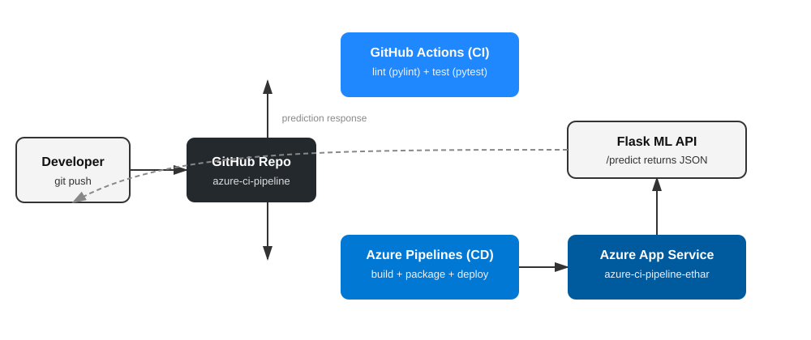
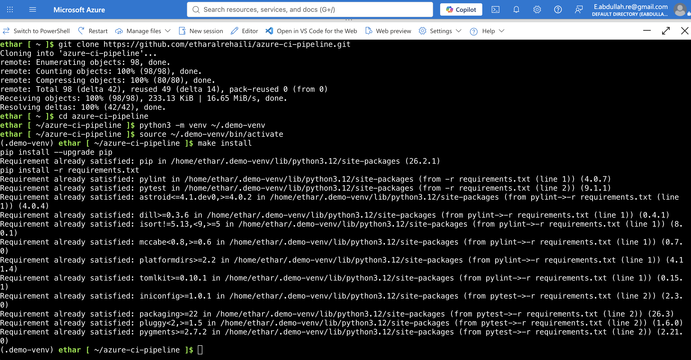
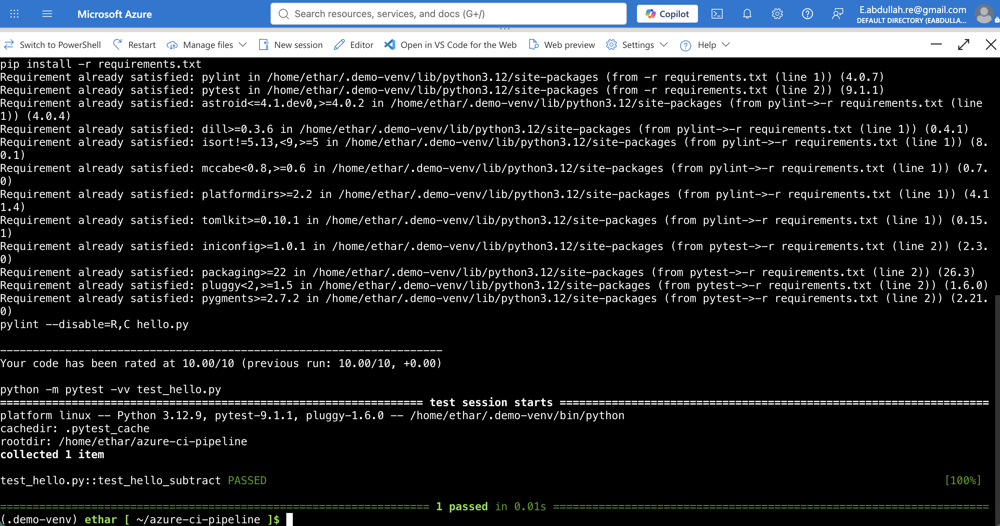
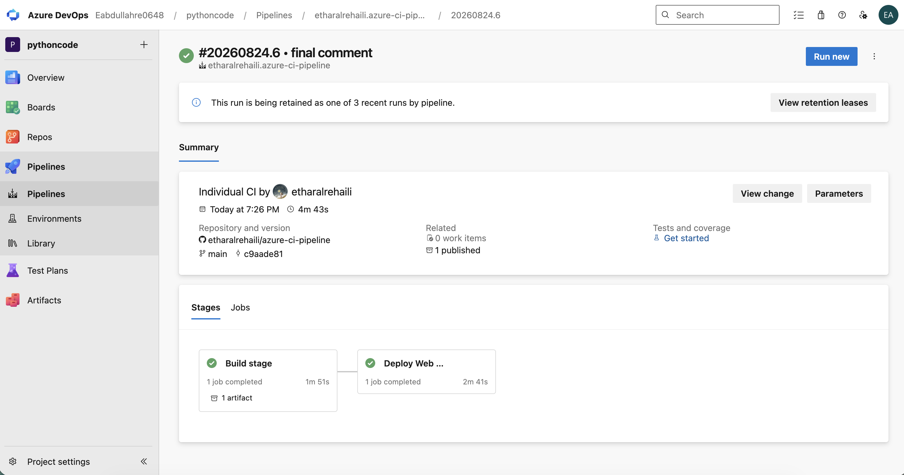
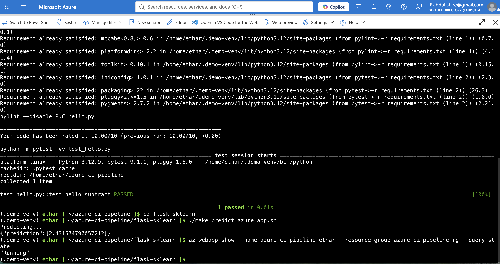
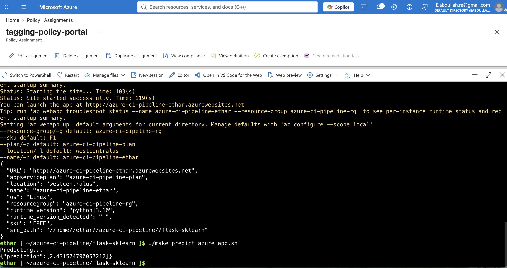

# azure-ci-pipeline
This repo is for the Cloud DevOps using Microsoft Azure course

[](https://github.com/etharalrehaili/azure-ci-pipeline/actions/workflows/python-app.yml)


# Overview

This project sets up a CI/CD pipeline on Microsoft Azure for a Flask machine learning API that predicts Boston housing prices. GitHub Actions handles Continuous Integration (linting and testing), and Azure Pipelines handles Continuous Delivery, automatically building and deploying the app to Azure App Service on every push to `main`.

## Project Plan

* [Trello board](https://trello.com/invite/b/6a8c9662a2a003470a1f75cd/ATTIa33111d19ecbb54e2b9b967f4e3e1c0424D1F226/azure-ci-pipeline) — tracks all major tasks and milestones for this project
* [Project plan spreadsheet](https://docs.google.com/spreadsheets/d/1VSnN02s8MG6Lm-1X8oxR-_r4qlfQS-yE1XfkoLnpex4/edit?usp=sharing) — quarterly/yearly plan, weekly deliverables, and task estimates

## Instructions

### Architectural Diagram



### Running the project

1. Clone the repo:
```
   git clone https://github.com/etharalrehaili/azure-ci-pipeline.git
   cd azure-ci-pipeline
```
2. Set up a virtual environment and install dependencies:
```
   python3 -m venv ~/.azure-ci-pipeline
   source ~/.azure-ci-pipeline/bin/activate
   make install
```
3. Run lint and tests:
```
   make all
```
4. The Flask ML app (`flask-sklearn/`) auto-deploys to Azure App Service via Azure Pipelines on every push to `main`. Live app:
   `https://azure-ci-pipeline-ethar.azurewebsites.net`
5. Test a live prediction:
```
   cd flask-sklearn
   ./make_predict_azure_app.sh
```

### Screenshots

Project cloned into Azure Cloud Shell:


Passing tests and lint output from `make all`:


Successful deploy in Azure Pipelines:


Azure App Service running, with a successful prediction from the deployed Flask app:


Output of `commands.sh` (Azure CLI deployment) showing the deployed URL:


## Enhancements

Future improvements could include: adding a staging deployment slot in Azure App Service for safer rollouts before hitting production, adding integration tests that hit the live `/predict` endpoint as part of the CI pipeline, adding Application Insights for monitoring and alerting on the deployed app, containerizing the app with Docker for more portable deployments, and expanding the model to support additional housing features or a more recent dataset.

## Demo

https://www.youtube.com/watch?v=BSiFoYAATVg
